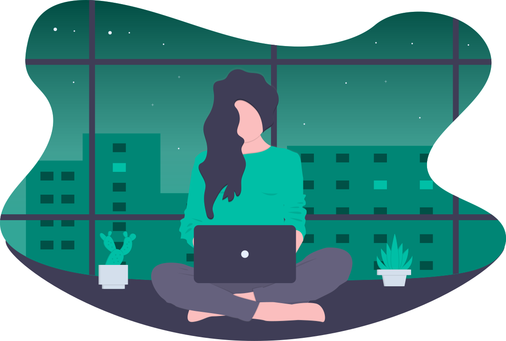

# ML-Powered Posture Detection 

Upright uses your laptop's camera to analyze and help you improve your posture. Register and calibrate the system in less than a minute, and simply keep Upright open in the background and continue working. Upright will notify you if you begin to slouch so you can correct it. Upright also has the Upright companion iOS app to view your daily metrics. 

Features include:
- Smarter slouch detection with ML
- Little overhead - get started in < 1 min
- Native notifications on any platform
- Track progress with mobile device

### Inspiration

With more people at working at home due to the pandemic, we felt empowered to improve healthcare at an individual level. Existing solutions for posture detection are unreliable, expensive, and lack cross-platform support. We sought to remedy these issues and build Upright.

### How It Works

Once you register, Upright asks you to sit up straight to have an initial measurement for a baseline reading. Then, Upright runs as a menubar app in the background. The application uses facial and upper-body landmarks in its model to determine whether you are slouching relative to the baseline you set. If Upright determines that you are slouching, you'll see a notification on your screen that will fade once you correct your posture. Your slouching data will also be securely sent to the iOS companion app where you can see your health data over time.

### Technologies Used

- Tensorflow for slouch detection model
- Firebase (Firestore) for cross-platform posture data storage
- JavaScript for Electron desktop application
- Swift for iOS companion app

### Installation

Inside the `upright-app` directory, run:

    npm install

Note you may need to run

    npm install --force
    
If your versions of electron and menubar don't match the package.json.

### Usage

    npm start
